# Speaker notes

Generated by `build_slides.py`. Do not edit by hand: the notes live in the
`SLIDES` list in that file, and this is rewritten on every build.

---

## 1. Leveraging LDP for High-Trust OpenSearch UBI

*Tuning search when you can't store the queries*

Open by naming the tension. We need behavioural data to tune relevance, and we are increasingly not allowed to keep it. This talk is about doing both.

---

## 2. About me

- Independent consultant at Mountain Fog
- OpenSearch UBI and opensearch-migrations maintainer
- Apache Software Foundation member, OpenNLP PMC Chair
- PII redaction tooling at Philterd
- Works in search, NLP, and privacy

<https://jeffzemerick.dev>

Keep this to about 30 seconds. The credential that matters for this talk is the PII redaction work, because it is why the privacy problem is familiar rather than academic. The UBI maintainership is why the OpenSearch half is credible. Do not read the list.

---

## 3. Part 1. The problem

About 8 minutes. Goal is that everyone understands the problem before any code appears.

---

## 4. To tune search you have to see what users do

- Relevance is measured
- Which queries fire, which results get clicked, at which position
- Learning-to-rank trains on exactly this signal
- Without it you are guessing, and shipping guesses to production

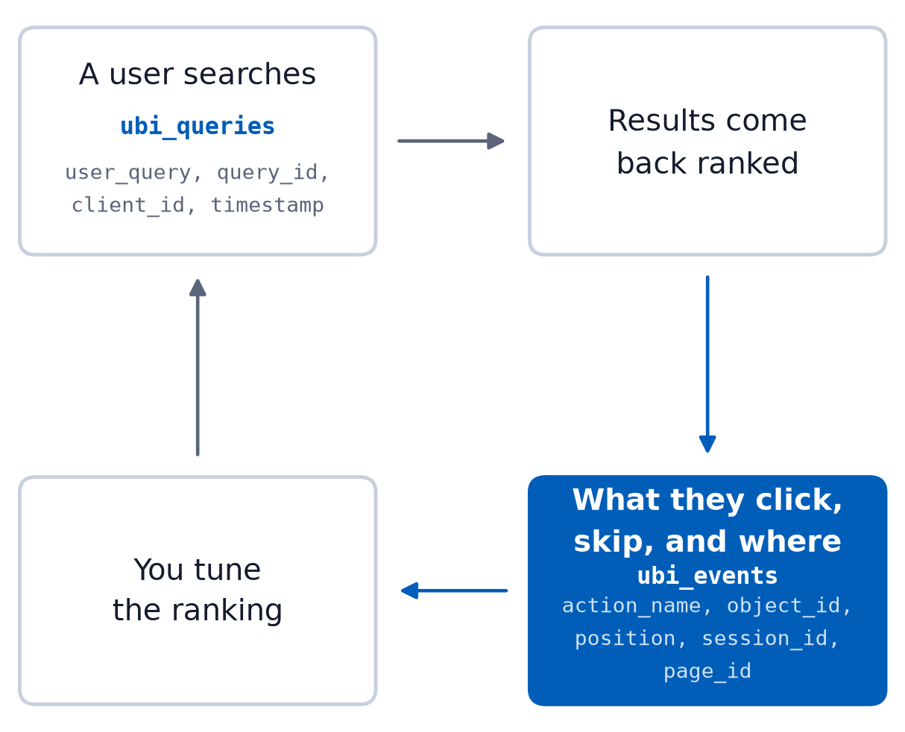

Establish that behavioural data is not a nice-to-have. It is the input to the entire discipline. Everything after this depends on the audience accepting that.

---

## 5. OpenSearch UBI exists for this

- `ubi_queries`:  `user_query, query_id, client_id, timestamp`
- `ubi_events`:  `action_name, object_id, position, session_id, page_id`
- `ubi.js` collects interactions in the browser and ships them to the cluster
- This is the raw material relevance tuning runs on

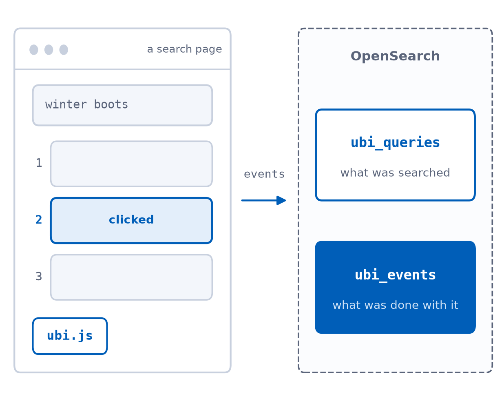

For examples and code, go to <https://ubisearch.dev>

Keep this factual and quick. The audience needs the field names because the next slide points at three of them specifically.

---

## 6. Legal rules won't let us see the user queries

- `user_query` is free text and can contain *anything*
- Telling users not to enter PII or PHI does not stop them
- `client_id` and `session_id` make it linkable across time
- Zero-trust becomes a blocker to relevance tuning

Be specific. Legal does not object to 'search data' in the abstract. They object to these fields. Naming them makes the rest of the talk concrete. Know which half you are about to solve: everything after this addresses user_query. The identifiers are dealt with on the limitations slide, so do not imply here that they go away too.

---

## 7. Redaction is reactive and sometimes too late

- You collect the PII first, then try to remove it
- Leaked PII is discovered later
- A free-text query has no schema to redact against
- The fix has to be that the sensitive value never leaves the device readable

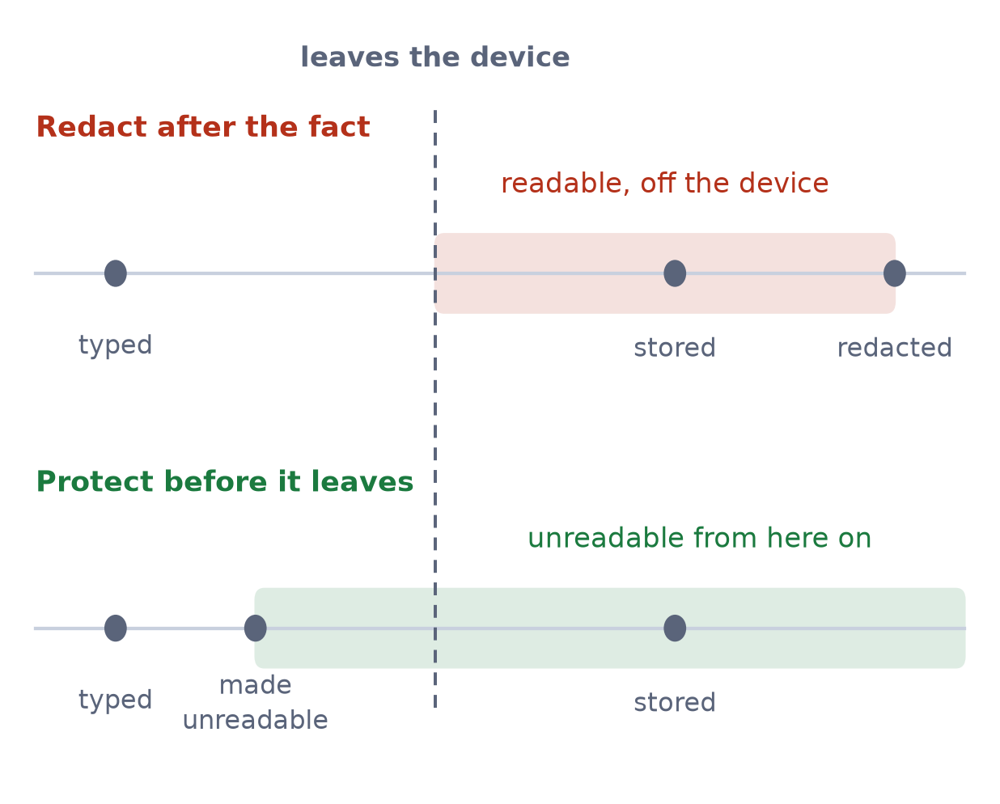

Still need to redact data at rest? <https://philterd.ai>

This is the 'move away from reactive data scrubbing' promise from the abstract. Say plainly that you build redaction tooling and that it is the right tool for documents at rest. That makes this a statement about ordering rather than a swipe at a technique, and it preempts the obvious 'what about redaction' question. Land it as a shape-of-solution argument, not a tooling argument.

---

## 8. Part 2. Embeddings are not anonymization

About 5 minutes. This exists to kill the objection half the room is already forming.

---

## 9. The obvious first idea

- "We will not store the text. We will store the embedding."
- It's numbers, not words
- It is not private, just a lossy encoding
- Vector inversion recovers the intent

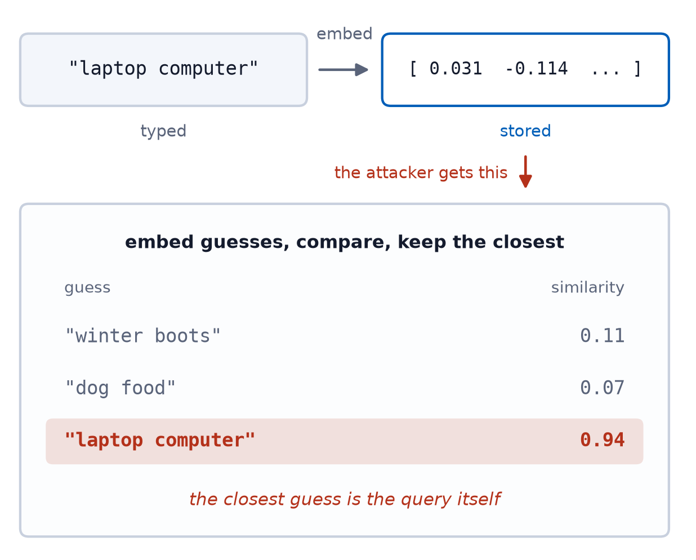

Morris et al., Text Embeddings Reveal (Almost) As Much As Text: <https://arxiv.org/abs/2310.06816>

Say the objection out loud in the audience's voice before you refute it. If you skip this, a good chunk of the room thinks the problem is already solved.

---

## 10. The same attack on both vectors

*The attacker looks up the nearest documents to whatever vector they intercepted*

| Attacker intercepts | Their best guess | Distance |
|---|---|---|
| The raw vector | Laptop | 0.2092 |
| The noised vector | Gaming Console | 4.8870 |

*Query "laptop computer" at epsilon 1.2, from notebook section 9*

Notebook section 9, run beforehand rather than live. Read the 20 documents aloud first, they fit in one breath, so the room can hold the whole index in their heads. Then let the top row speak: the raw vector hands over the intent. Do not rush this, it is the hinge of the talk. The distance column is the part people miss, so point at it. The noised vector is not merely wrong, it is 4.9 away from everything, so which document wins is close to arbitrary. The number to have ready if someone wants it: its top five candidates all sit within 0.15 of each other, while real documents in this index are at least 0.89 apart, so the ranking is a tie rather than a wrong answer. Two things to be straight about if asked. This is a nearest-neighbour lookup against the index rather than literal text inversion, which is a weaker attacker than the Morris paper on the previous slide assumes, and it still succeeds. And epsilon 1.2 is the rigged setting Part 4 comes back and confesses to.

---

## 11. The raw vector gives up the intent

- Query: "laptop computer"
- Attacker inverts the raw vector, top hit: Laptop
- Intent was leaked even though no text was stored
- Storing embeddings is not a privacy control

This is the result the rest of the talk builds on. Pause here.

---

## 12. Part 3. The fix and the proof

About 7 minutes. Mechanism briefly, then two verification beats, weakest to strongest.

---

## 13. Local Differential Privacy

- The vector was never the problem, storing it readable was
- Add calibrated noise to the query vector on the device
- Epsilon is the dial, and lower epsilon means more noise and more privacy
- The user's query is not stored so there is nothing to redact

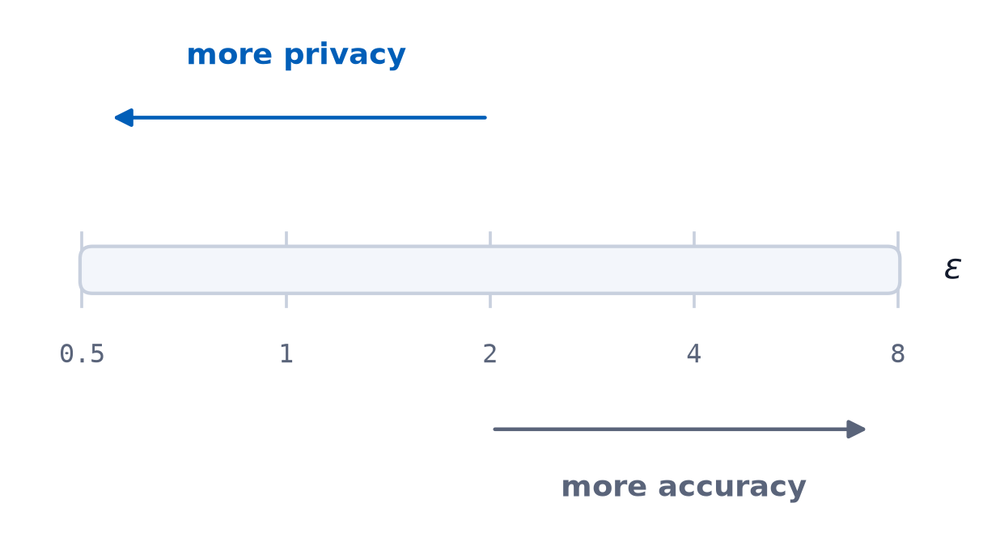

More on local differential privacy: <https://en.wikipedia.org/wiki/Local_differential_privacy>

One slide only. Resist the urge to teach differential privacy properly, there is not time and it is not the point of the talk. The noise is Laplace, but the word can wait for the next slide, where the shape is on screen and does the explaining for you. If someone asks here, one sentence: symmetric noise, equally likely to push the value up or down, centered on the truth. The formula is deliberately off the slide. If someone asks, the noise scale is sensitivity over epsilon, and sensitivity here is 1.0 per coordinate on vectors whose whole norm is 1, which is conservative rather than tight. The notes file has the longer answer. Do not volunteer the word, it is the only term in the deck with no definition behind it.

---

## 14. Verification 1: the noise is what we claim

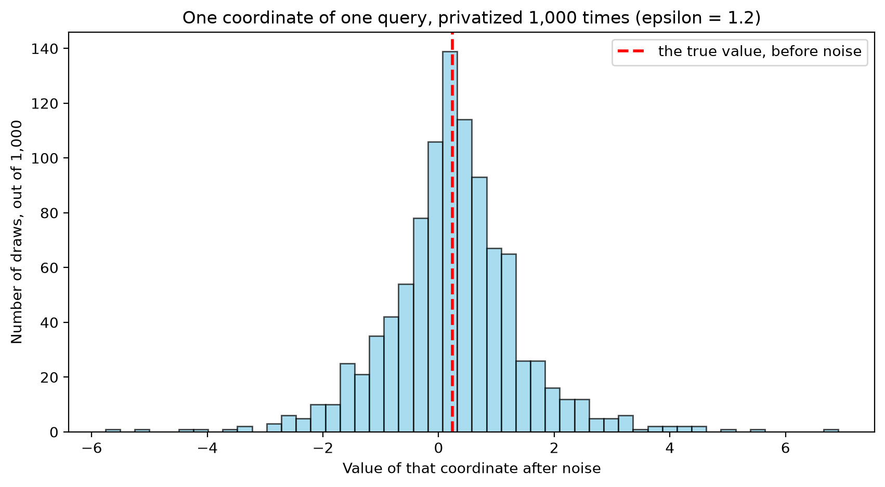

*A biased mechanism would put the peak off the red line, and the width is the privacy.*

This is the distributional check. It proves the mechanism is implemented correctly. It does not prove an attacker fails, which is why the next slide exists.

---

## 15. Verification 2: measure an actual attacker

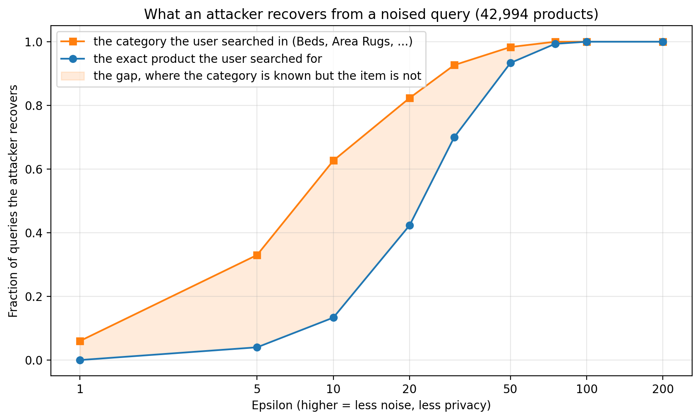

*The category leaks well before the item does. At epsilon 1, neither is usable.*

Data: WANDS, Wayfair product search relevance (ECIR 2022), MIT licensed: <https://github.com/wayfair/WANDS>

Stronger evidence than the histogram, because it measures an adversary rather than a distribution. This discharges the 'verify, do not hope' promise in the abstract. Head off the obvious confusion: the previous slide used epsilon 1.2 and this axis runs to 200. Epsilon is not portable between indexes, because what matters is the noise scale relative to the spread of the coordinates, and that spread differs between the 20-document PCA and this 43,000-document one. On the baselines: the query is 'solid wood platform bed', whose class Beds holds 1,112 of the 42,994 products, so class chance is 2.6 percent and item chance 0.002 percent. Class recovery of 6 percent at epsilon 1 is low but not nothing. Do not oversell the item curve either: 13 percent at epsilon 10 is still about 5,600 times chance, so the claim is that the category leaks first, not that the item is safe. This is where the limitations slide gets its first bullet, so it lands later as a callback rather than a new admission.

---

## 16. Part 4. What it costs

About 7 minutes. Volunteer the weakness before anyone asks. This buys credibility for Part 5.

---

## 17. That first demo was rigged

- It ran at epsilon 1.2 on a 20 document index
- The attacker learned nothing, and neither did the user

Say this yourself. If it comes out in Q&A instead, the talk loses. Volunteering it is what makes Part 5 believable.

---

## 18. Epsilon 1.2 is barely better than guessing

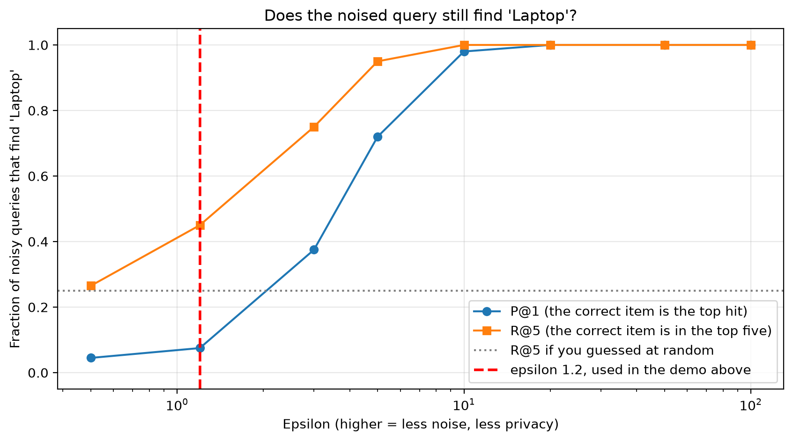

*The red line is where the first demo ran. Utility only comes back where the attacker wins too.*

Go to the red line first and stay there. That is the demo from Part 2, with the top hit correct 7 percent of the time against a 5 percent baseline, and the top five 45 against 25. Barely above guessing, which is the confession from the previous slide made visible. Then sweep right to make the second point, that utility only returns as epsilon rises, and by then the attacker is reading the query too. Note the curves rise here where slide 15's rose for the attacker: up means the search still works. Exact values if asked: at epsilon 1.2, P@1 0.07 and R@5 0.45; at 3, 0.38 and 0.75; at 5, 0.72 and 0.95; at 10, 0.98 and 1.00. Resist calling epsilon 3 to 5 a usable window. P@1 of 0.38 is eight times chance, so the attacker is already doing well there. The honest version of that argument needs the real index, which is the next slide.

---

## 19. Part 5. What you keep

About 8 minutes. This is the payoff and the answer to Part 4. Give it the most room.

---

## 20. The asymmetry is the whole point

- Laplace noise is zero-mean
- It cancels when you average over many independent users
- One person's query is unrecoverable
- The trend across ten thousand people is not
- That trend is all UBI needs to tune relevance

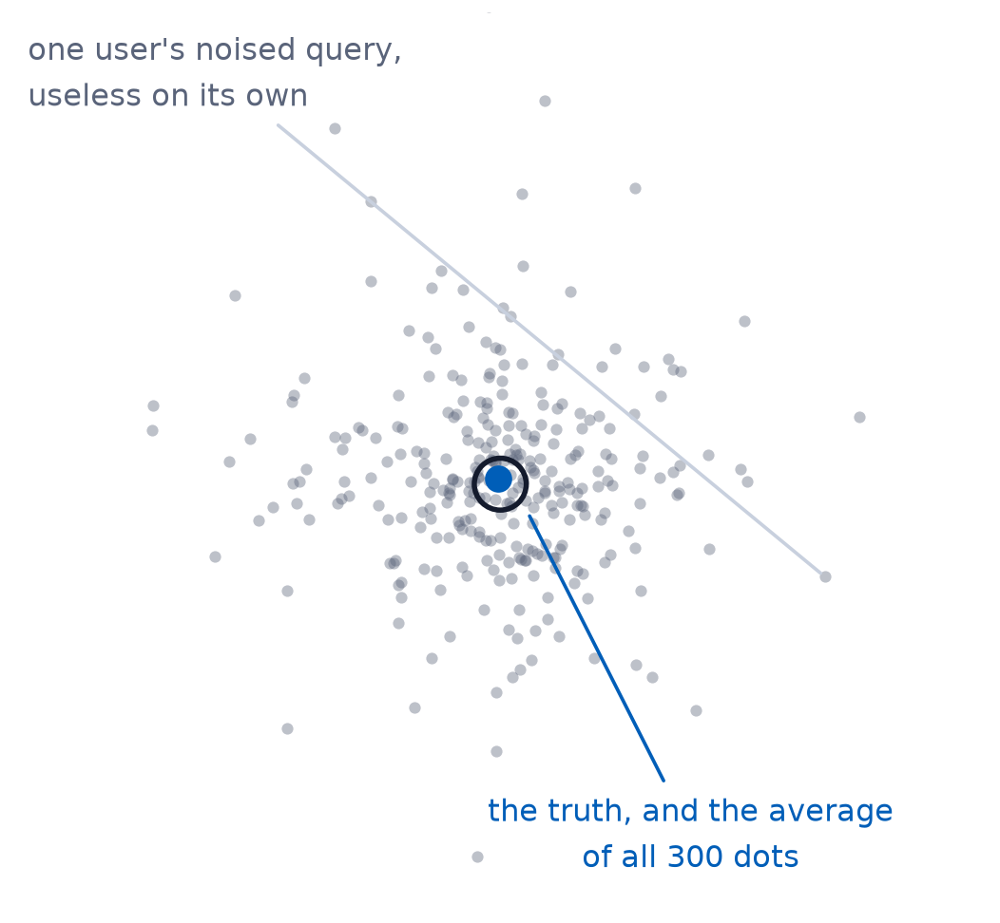

This is the conceptual core of the talk. Everything before it was setup. LDP is not a privacy tax, it is a trade of individual resolution for population accuracy.

---

## 21. Demo: segments of real users

- Notebook section 11
- 480 real queries from Wayfair's WANDS dataset, grouped into 5 segments
- Every user privatizes independently, on their own device

This is the only live notebook moment in the talk, so have the kernel primed before you walk on: run sections 1 and 2 for the model, then 10a for the cached data. Section 11 raises a NameError without 10a. If the kernel died, those three take about five seconds. Stress that no one in a segment sends a readable query, and the server does the aggregation on noised vectors only. There is no trusted intermediate step. Read the result off the notebook rather than a slide, because both halves matter. Individual recovery per segment runs 0.020, 0.020, 0.063, 0.070 and 0.030 against chance of 0.014 to 0.031, so roughly one to two and a half times chance, which is not usable. Segment identification is 5 of 5, exact. Same data, same epsilon of 1.0, two different questions.

---

## 22. Error falls as 1 / sqrt(users)

*Average the noised queries of `n` users in one segment, then see how far that average lands from the truth.*

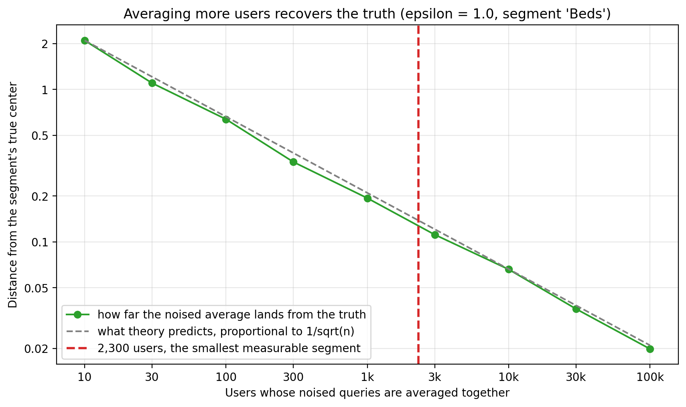

*The red line is the smallest segment you can measure.*

The centerpiece. Take the shape first. More users, less error. The measured green line tracks the predicted grey one across four orders of magnitude. This is ordinary statistics, so say so: averaging n independent things shrinks the noise as one over root n, the same reason a poll of four thousand beats one of one thousand. Nothing here is special to privacy. Then the red line. Read it off the bottom axis: 2,300 users. That is the answer, and it is the next slide. If asked where 2,300 comes from, it is where the measured error drops under 0.128, the average spread of one coordinate across the index. That bar is strict on purpose. Two typical products sit about 0.82 apart, so the line is roughly six times stricter than just telling products apart.

---

## 23. How big a segment has to be

- Error drops below the spread of the index at roughly 2,300 users
- That is at epsilon 1, and halving epsilon needs four times the users
- Segments with thousands of users are measurable under LDP
- Segments with dozens are not measurable
- Your head terms work, but your long tail does not

Give the audience one operational number they can apply on Monday. This is it. The 2,300 is where the measured error crosses the spread of the index, 0.128, on the convergence plot. It is not a constant: error goes as one over epsilon times one over root n, so the threshold scales as one over epsilon squared. At epsilon 0.5 it is about 9,200 users, at epsilon 2 it is about 575.

---

## 24. LDP does not cost you your analytics. It costs you the ability to ask about one person.

The reframe. Every input relevance tuning actually needs is a population statistic. Let this sit on screen for a beat before moving on.

---

## 25. Part 6. Back in OpenSearch

About 7 minutes. Land the integration, then be honest about what does not work.

---

## 26. Where the noise gets injected

- On the device, before `ubi.js` sends the event
- Aggregation happens at query time over the noised data
- Nothing downstream needs to be trusted, because nothing downstream has the original
- You set epsilon in the client you ship

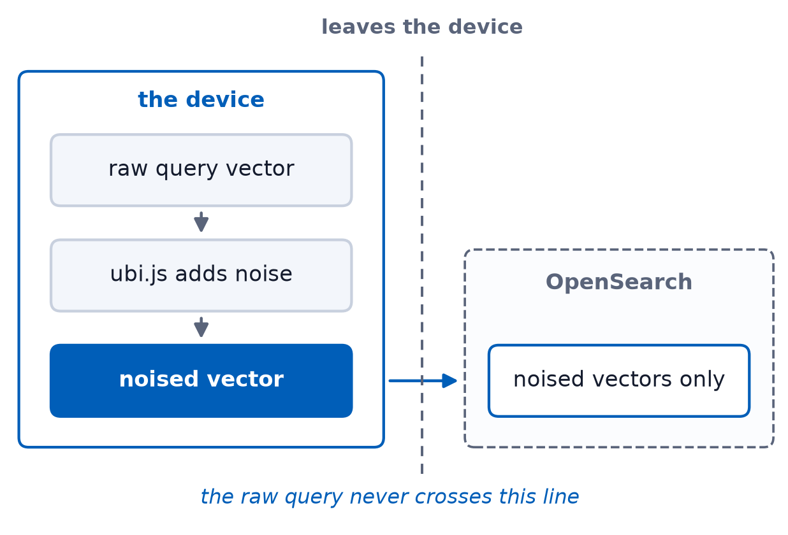

An upcoming UBI RFC will bring this capability into `ubi.js`

Say up front that none of this is built into UBI today. ubi.js is a serializer, and the embedding, the projection and the noise are code the adopter writes and runs before handing the request to trackQuery. The notes file has the call shape and the two ways to get it wrong. The architectural payoff. The trust boundary moves to the device, which is the only place the raw query legitimately exists. The last bullet answers the obvious objection, that the people collecting the data are the ones choosing how much privacy users get. True, and the standing critique of deployed LDP. The web deployment is the answer: because the mechanism ships as JavaScript, a user, an auditor or a regulator can open devtools and check the epsilon. A server-side pipeline or a native app cannot make that claim. It turns trust us into check us, which is the same promise as the rest of the talk.

---

## 27. What changes in ubi_queries

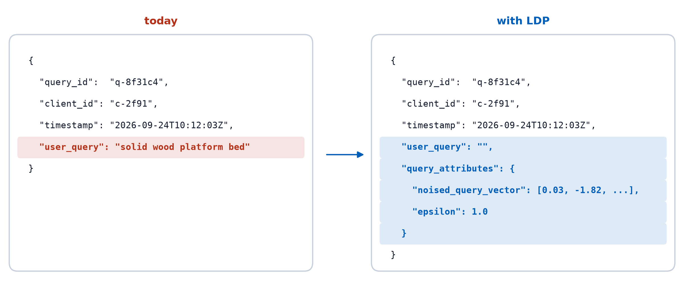

UBI supports this today through `query_attributes`, and the RFC will propose making it first-class

The integration question, answered concretely, and it needs no change to the UBI spec. query_attributes is typed as a free-form object for exactly this kind of thing, and the epsilon travels with the record so a reader knows the budget it was collected under. user_query is emptied rather than dropped because the published schema lists it as required. Worth knowing if someone asks: the schema contradicts itself there, since the field also carries a comment saying it is not required, for recommendation systems with no typed query. Two things to volunteer: the identifiers are deliberately identical on both sides, which is the limitation two slides later, and every dashboard that reads user_query breaks, which is the real migration cost. A float array in an object is not a knn_vector either, so averaging these at query time needs a scripted aggregation or an explicit vector mapping.

---

## 28. What your dashboards can still compute

- Aggregate query intent per segment
- Demand trends and shifts over time
- Segment-level training signal for learning-to-rank
- What they cannot do is show you one user's session

Tie back to the abstract's promise about LTR and query-intent analysis. Then name the thing that genuinely goes away. If anyone presses on the learning-to-rank bullet, be straight: LTR judgments come from clicks, and this mechanism does not touch clicks, so that signal survives because it was never protected rather than because LDP preserved it. The limitations slide says so.

---

## 29. The limitations

- The category leaks and that is worse for medicine than furniture
- What a given epsilon buys you depends on coordinate spread so it does not transfer between indexes
- Low-traffic segments stay unmeasurable
- This protects `user_query` but `ubi_events` still holds clicks and ids in the clear

Every one of these is a question someone will ask. Answering them first is cheaper than answering them under pressure. Also mention that a formal epsilon-DP claim needs sensitivity calibrated to the true coordinate range. Here the vectors are L2-normalized before PCA, so the whole 20-dimensional vector has norm 1, which makes sensitivity 1.0 per coordinate conservative rather than tight. That is the answer if someone asks how sensitivity was set. Two follow-ups come off that bullet. Asked how often epsilon needs re-tuning, say when you re-embed or refit PCA, because routine additions to a large index do not move the coordinate spread, and normalizing before PCA keeps sensitivity itself stable whatever the catalogue holds. Asked whether privacy decays over time, say yes but not through epsilon: one user's repeated queries compose, and an attacker who averages that one user's own noised draws recovers the intent, which is the asymmetry from Part 5 turned around. Epsilon is a budget per release rather than a standing property, so the fix is rotating or dropping client_id and session_id, not a smaller epsilon. On the long tail, which someone will ask about: the workarounds are coarser segments and longer time windows, and both are the same trade at lower resolution, because they only raise n. The genuinely different answer is shuffle DP or secure aggregation, which buys far more utility at the same epsilon but changes the architecture rather than the parameter. Worth adding that tail relevance is usually improved by retrieval work rather than behavioural signal anyway. On the last bullet, be direct: this is scoped work, not a finished privacy story for all of UBI. The query text is covered. Clicks are counts rather than vectors and want randomized response, and client_id and session_id would need rotating or dropping. That is the honest answer to the linkability half of the problem raised in Part 1.

---

## 30. Takeaways

- Storing embeddings instead of text is not privacy
- Keeping sensitive data out of the index beats redacting it later
- Verify the mechanism by attacking it, not by trusting it
- You trade individual resolution for population accuracy, and relevance only needs the latter

Four sentences. If someone remembers only one, it should be the last.

---

## 31. Questions

*github.com/jzonthemtn/ldp-for-search*

Have the notebook open on the convergence plot behind you during Q&A. Likely questions: formal DP guarantee, why PCA, composition across repeated queries from one user, why not just hash the query.

---

## Appendix: should UBI standardize the vector?

Expect this from the room, given the `ubi_queries` slide. The position:

**File the spec bug now, separately.** `schema/1.3.0/query.request.schema.json` lists
`user_query` in `required`, while the field's own `$comment` says it is "currently not
required to support recommendation systems etc that might not have a user generated
query". Both statements are in 1.2.0 and 1.3.0. That needs an issue, not an RFC, and it
blocks any privacy-preserving use of the schema.

**Not yet for a top-level vector field.** A bare `query_vector` is not self-describing. A
consumer also needs the embedding model, the PCA basis (the notebook persists
`wands_pca.npz` for exactly this reason, and without it the coordinates mean nothing
across deployments), the sensitivity, and the epsilon. Several shapes are also unsettled:
one epsilon or per-coordinate budgets, fixed or per-deployment dimensionality, whether
`ubi_events` gets a parallel treatment. A top-level field has to answer those.
`query_attributes` lets us defer them, which is what it is for.

**The argument that eventually wins is semantic.** A privatized query is not a query
modifier, it is a substitute for `user_query`. It is primary content in a different
representation, and `query_attributes` is documented as filter choices, pagination and
experiment identifiers. Primary content in the metadata bag is fine for one
implementation and wrong once there are five.

**So: ship it under `query_attributes`, and put the standardization question to the
room.** This is an unusually good place to find the second and third implementers, and an
RFC with three interested parties goes very differently from one with a conference talk
behind it. If something is opened sooner, scope it to the envelope, a
`query_representation` object carrying mechanism, model, basis reference, epsilon and the
vector, rather than a bare vector field. The envelope is the part that has to be agreed
for anyone else's tooling to read the data.

## Appendix: implementing this in ubi.js

`ubi.js` does not build vectors, but it does not need changing either. It is a thin
serializer, and `query_attributes` is already a constructor argument
(`opensearch-project/user-behavior-insights`, `ubi-javascript-collector/ubi.js`):

```js
const q = new UbiQueryRequest(app, clientId, queryId,
  "",                                   // user_query emptied
  "product_id",
  { noised_query_vector: v, epsilon: 1.0 });
await ubiClient.trackQuery(q);
```

The work is a pre-step that produces `v`: embed the query, L2-normalize, project through
the PCA basis, add Laplace noise. The basis ships to the client too, about 30 KB as
float32 for 20 x 384. It is public, not a secret.

**Embedding in the browser, two options.** `transformers.js` runs `all-MiniLM-L6-v2` as
ONNX over WASM or WebGPU, which puts the queries in the same space as the product index,
at the cost of roughly 23 MB quantized on first load. Or skip the model entirely and hash
character n-grams into a fixed-width vector, applying the same scheme to products
server-side. That loses synonym matching but needs no download, and for segment-level
intent it may be enough.

**Never sample the noise with `Math.random()`.** V8 implements it as xorshift128+, and the
internal state is recoverable from a handful of outputs. An attacker who predicts the
stream subtracts the noise exactly and recovers the raw vector, which does not weaken the
guarantee, it voids it. Use `crypto.getRandomValues()`, then inverse-CDF with
`u ~ Uniform(-0.5, 0.5)`:

```js
const noise = -b * Math.sign(u) * Math.log(1 - 2 * Math.abs(u));
```

Reject `|u| === 0.5` or that returns `-Infinity`.

**Privatize on submit, never per keystroke.** Autocomplete firing on every character
spends the budget many times over on one intent, and the draws compose, so an attacker
who averages them recovers the query. This is the practical face of the composition
question on the Questions slide.

## Appendix: why PCA, and what "coordinate spread" means

No slide mentions PCA, which is deliberate, but it is not optional in the mechanism and it
is the first thing an implementer will trip over.

**Why reduce dimensions at all.** The encoder emits 384. Laplace noise is added to every
coordinate independently, so the norm of the noise vector grows as the square root of the
dimension while the signal does not. Going from 384 to 20 cuts the noise norm by about
4.4x at the same epsilon, which is the difference between a usable mechanism and one that
destroys everything. The price is variance: the notebook keeps 41.9% of it at 20
components.

**The basis has to be fixed and shared.** PCA is fit once on the index vectors and the
same basis is applied to queries, which is why `download_wands.py` persists
`wands_pca.npz`. Refit it and every stored vector becomes meaningless, because they no
longer live in the same space.

**What "coordinate spread" means on the limitations slide.** It is the mean per-coordinate
standard deviation of the index vectors, `wands_vectors.std(axis=0).mean()`, which is
0.128 for the 20-dimension WANDS basis. Epsilon only means something relative to that
number. A different corpus, or the same corpus at a different number of components, gives
a different spread and therefore a different usable epsilon. That is the whole content of
"epsilon does not transfer between indexes", and it is also why the toy index in Part 4
needed epsilon 1.2 while the real one is discussed at 1 to 20.
